# ShareSphere Server

**🌟 Welcome to ShareSphere Server!**

**The Share Sphere App is a social media platform that allows users to share posts and interact with each other. This README file provides an overview of the websites's features and functionalities.**

## running the server
- Download the repository to your computer.

- Changeg the directory in terminal to Server.

- Install dependencies (for running the app) using **npm install**.

- Create config file containing: the port you would like to run on and the MongoDB connection string.
Insert into the .env file the following:
**CONNECTION_STRING="mongodb://localhost:27017" (replace with your connection string)
PORT=8080 (replace with the port you would like to run on)**

- Open MongoDB on your computer.

- **Please notice:** The first time you will run the server, a JavaScript script will run and initialize the DataBase. it will be initialized with: 7 default users, 10 posts from the diffrent users and comments. When the process is done, you will see in the termianl "Data inserted successfully.". **Please check you don't have other *collections* named: users, posts, comments**.

- Run the server using **npm start**.

- In order to get to the web application, please open your browser and search for: "http://localhost:Port number chosen in config/".

- In order to run the app, go to the app's github repository, enter the **Production Branch**. All the inforamtion needed is there, and the new version of the app (the main branch includes the second part od the project).

- **🚀 Pro Tip:** Log in with the user tal144155 (Password: tal2024) for an optimal experience, though any account will do.

## About the app:

The name "ShareSpere" is a fusion of two key concepts: "Share" and "Sphere," each contributing to the essence of our social media platform.

### Share

At ShareSpere, sharing lies at the heart of our community. Whether it's sharing moments, ideas, or experiences, our platform is designed to facilitate seamless sharing among users. Connect with friends, family, and the world by effortlessly exchanging content in an inclusive and engaging environment.

### Sphere

The term "Sphere" brings the idea of a rounded or three-dimensional space. In the context of ShareSpere, it signifies the virtual space where our community thrives. It represents the interconnectedness of our users and the inclusive environment we strive to create.

## Features and functionality (website)
- After running the server, tou will be able to serve our site (with the domain you chose) or apllication (in android).

- After logging in, you will see your **Feed page**. In this page you will be able to see the most recent posts on ShareSphere, give each post a like (they deserve it!), comment and share.

- On the feed page you will be able to add a new post (please notice a post must contain text and image).

- When pressing your profile pic or name on the left-bar you will be redirected to your personal page.

- On your personal page you can see your own posts, edit\delete them, add comments and view your own friends.

- Also, in you profile page you can edit your own details, or delete your account.

- When pressing another users picture\name in the post, you will be redirected to his personal page.

- **Bonus Feature:** The server and React components includes the option to add comments to posts. Each comment is attributed to its respective user, who possesses the ability to edit or delete their comments. A dedicated API exists for this interactions. **Please note** that this feature is not currently available on the Android app, so refrain from pressing the comment button.

- **please notice:** when you enter another users profile page, if you are not friends, you will be able to send him a friend request but you will not be able to his posts. only when you are friends, you can see his posts **and his friends** in the profile page.

# 📸 Pictures from the website:

## Login page:
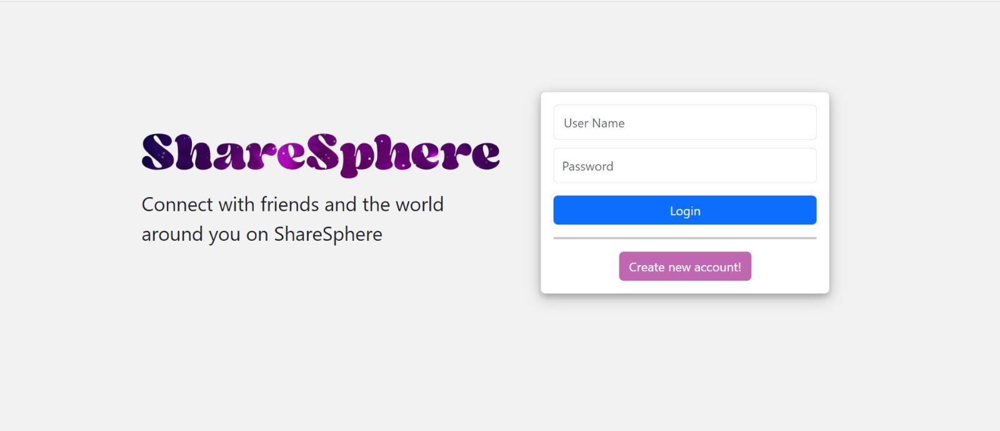

## SignUp page:
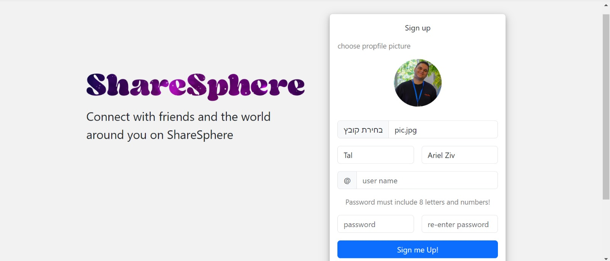

## Feed page:
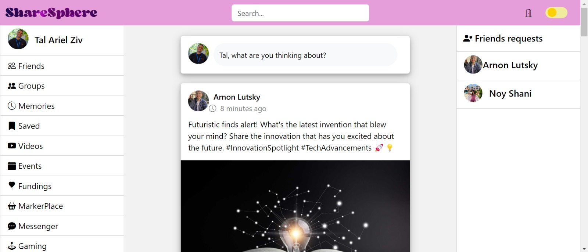

## Feed page (dark mode):
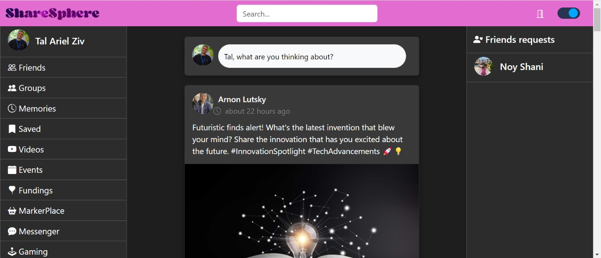

## Approving friends request
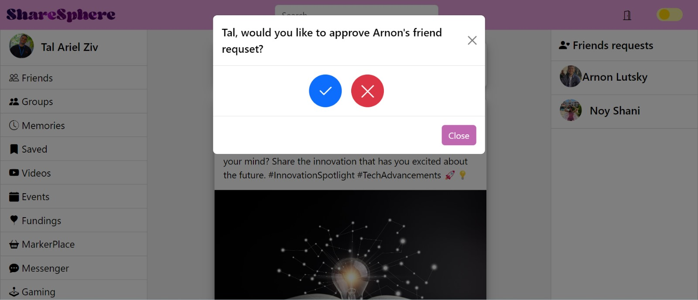

## Creating new post
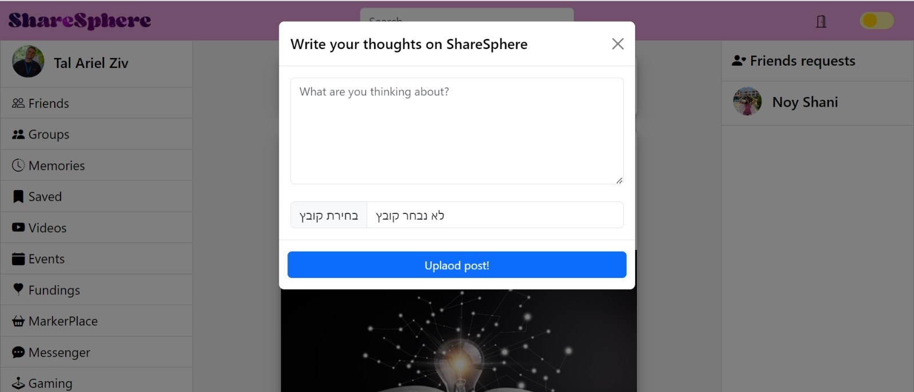

## Profile page (personal page)
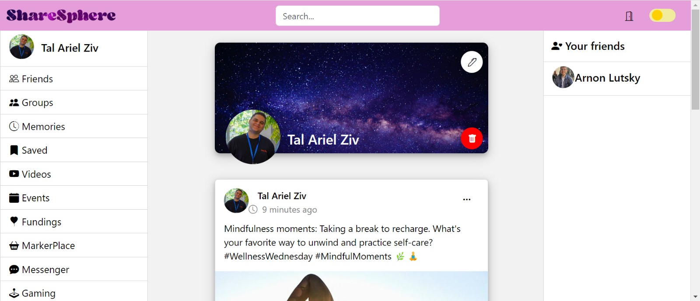

## Profile page (other user)
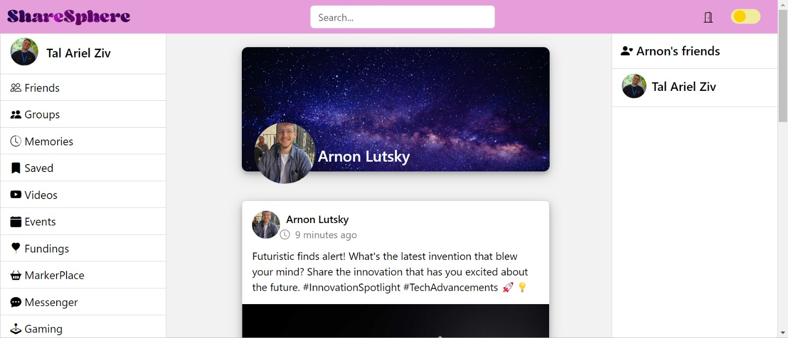

# 📸 Pictures from the app:

## Login:
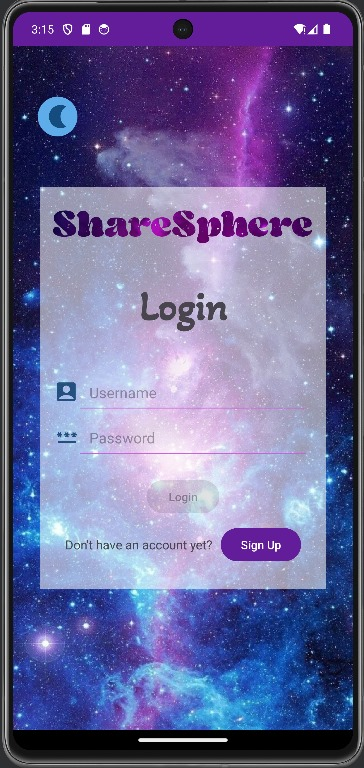

## Login (dark mode):
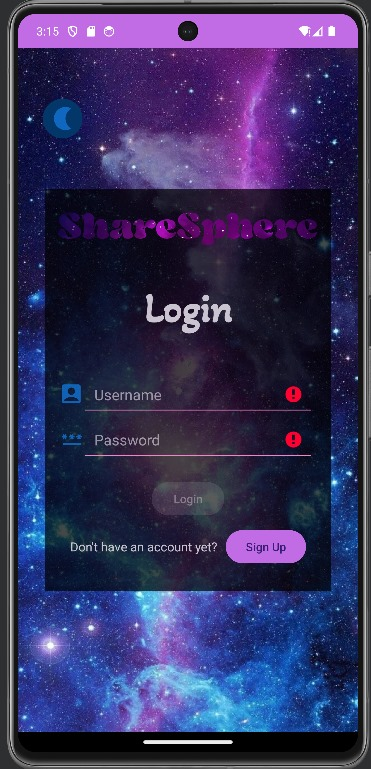

## SignUp:
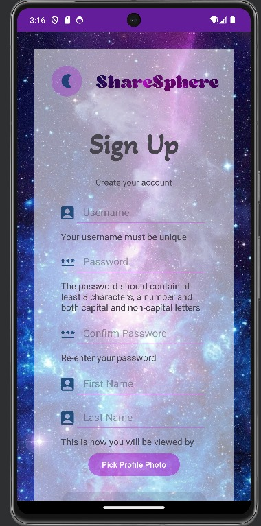

## Feed page:
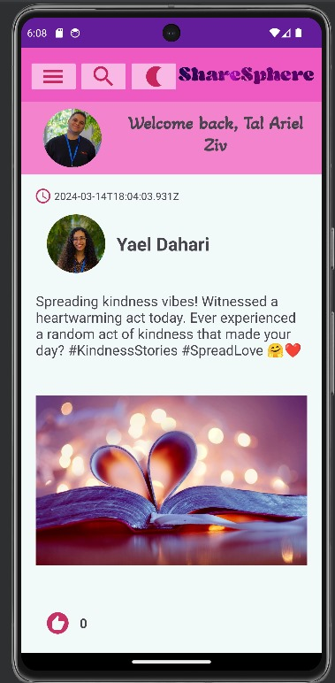

## Approving friends request
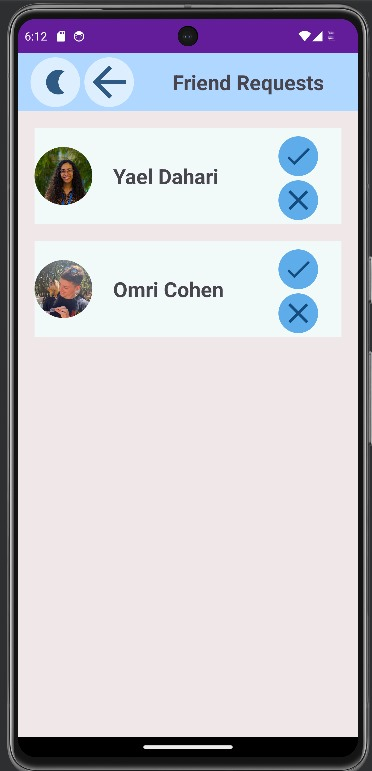

## Watching friends
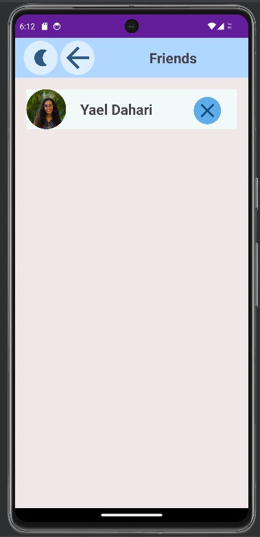

## Profile page (personal page)
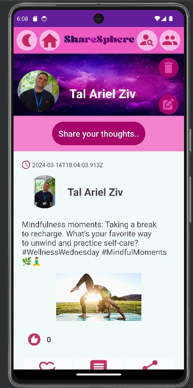

## Creating new post
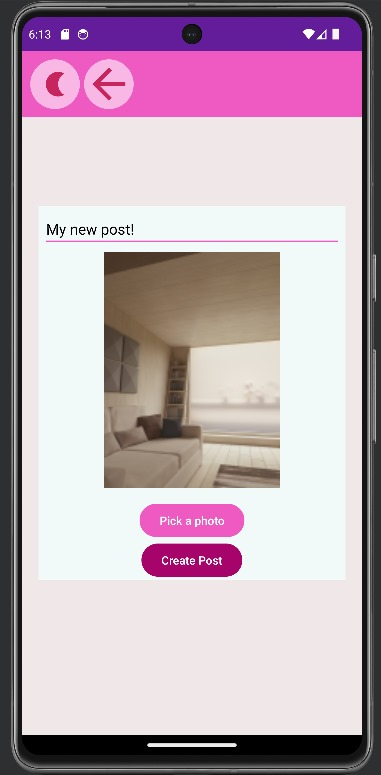

## Profile page (after adding post)
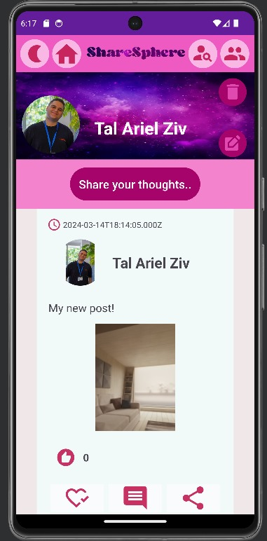

## Profile page (other user, not friend)
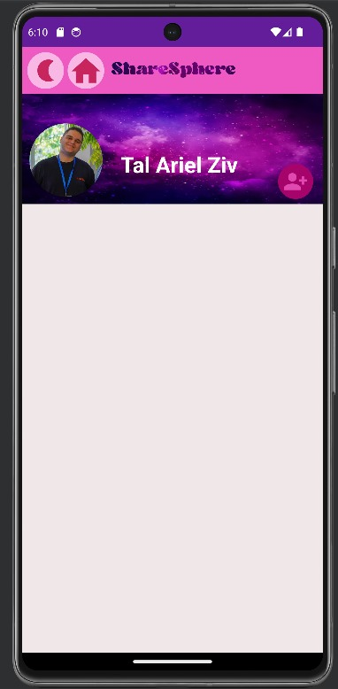

## 🌟 Dive into ShareSphere and start sharing your world! If you have any questions, feel free to reach out. Happy Sharing!
